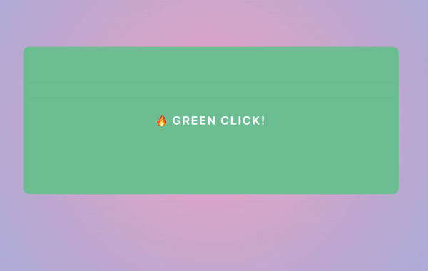
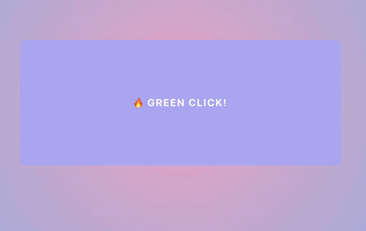

# 반응 게임

> 반응 속도를 체크할 수 있는 웹 게임.


#### 방법

- 초록색이 나오면 재빨리 클릭해야합니다.
  - 결과 단위는 `m/s`
- 보라색이 나왔을 때 클릭하면 `Fail`입니다.
- `Regame`을 통해 다시 할 수 있습니다.


#### 구현

- 색이 바뀌는 것은 ramdom으로 뽑았습니다.
  - 범위 `1초 ~ 2초`
  ```javascript
  // 10 <= x <= 20
  const randomTime = Math.floor(Math.random() * 20) + 10;
  ```
- 사용자가 클릭할 때까지 색이 바뀌는 함수가 재귀적으로 일어납니다.
  ```javascript
  // 배경 바꾸기
  const changeBg = async (randomTime: number) => {
    await sleep(randomTime);
    if (game.current) {
      const randomTime = Math.floor(Math.random() * 20) + 15;
      if (randomTime % 2) {
        startedTime = new Date().getTime();
        setBgColor("#78C79D");
        changeBg(randomTime);
      } else {
        setBgColor("#B5B0F2");
        changeBg(randomTime);
      }
    }
  };
  ```


#### 시연





